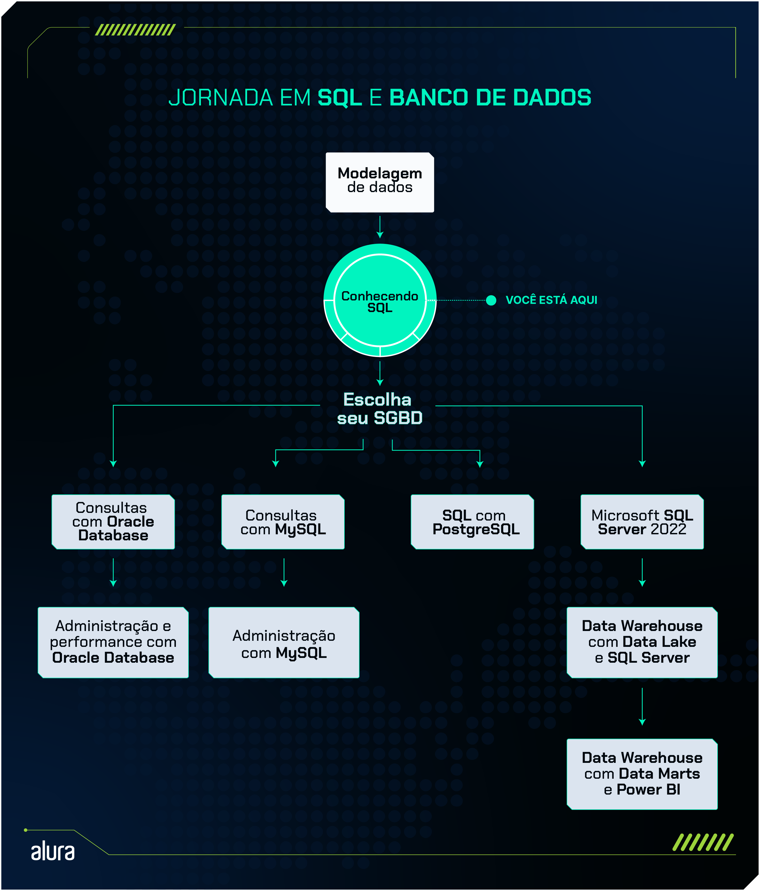

# [Formação Conhecendo SQL](https://cursos.alura.com.br/formacao-conhecendo-sql)

 SQL, uma linguagem estruturada para consultas a bancos de dados relacionais, que nos permite consultar e manipular os dados.

Nesta formação, você aprenderá a criar e gerenciar bancos de dados e tabelas, realizando operações diversas como consultas, atualizações e exclusão de dados. Aprofundaremos nas técnicas de filtragem para busca eficiente de informações, exploraremos recursos avançados para a elaboração de relatórios detalhados, e finalizaremos com a aplicação de SQL na análise de dados, proporcionando uma compreensão abrangente e prática da gestão de dados com SQL.

##

## 3º Passo - Avançando em SQL

Neste terceiro passo, aprofundaremos nosso conhecimento na linguagem SQL, explorando uma variedade de comandos avançados essenciais para a realização de consultas complexas. Vamos abordar o uso de UNION para combinar resultados de múltiplas consultas, SUBCONSULTAS para criar consultas dentro de outras, JOINs para unir dados de diferentes tabelas de forma eficiente, VIEW para simplificar consultas complexas, TRIGGERS para automatizar ações baseadas em eventos específicos e TRANSAÇÕES para garantir a integridade dos dados através de operações seguras. Este estágio é crucial para dominar a manipulação avançada de dados com SQL.

## [Curso: Realizando consultas com SQL: Joins, Views e transações](https://cursos.alura.com.br/course/realizando-consultas-sql-joins-views-transacoes)

### **Principais tópicos do curso**

- Utilizando o dafault na criação de tabelas
- Conhecendo sobre UNION e UNION ALL
- Utilizando SUBCONSULTAS
- Utilizando JOIN para realizar a junção de dados
- Implementando views e triggers
- Como executar transações

### **[Documentação SQLite](https://www.sqlite.org/docs.html)**
